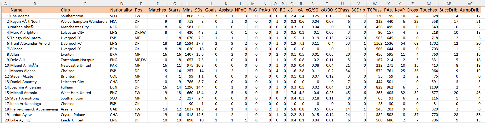
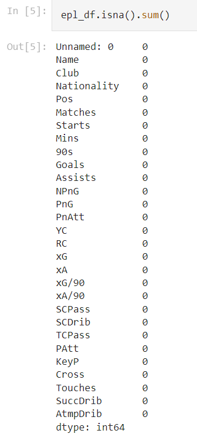
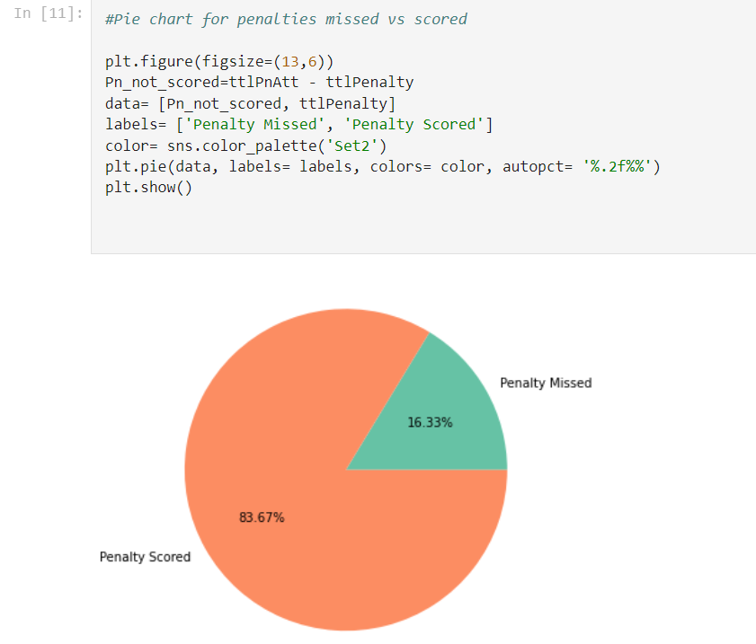
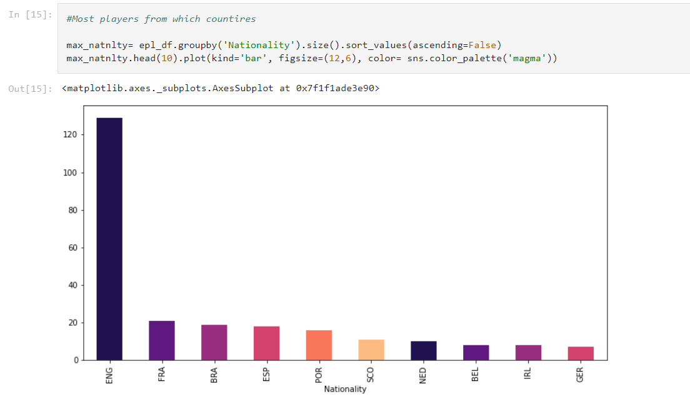
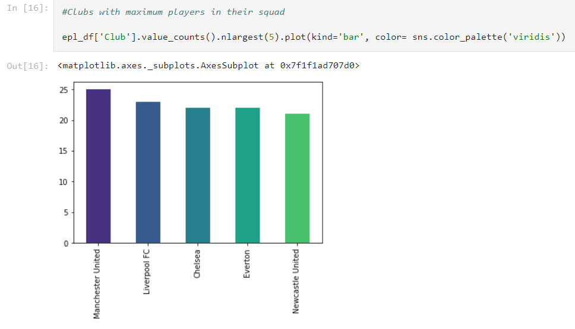
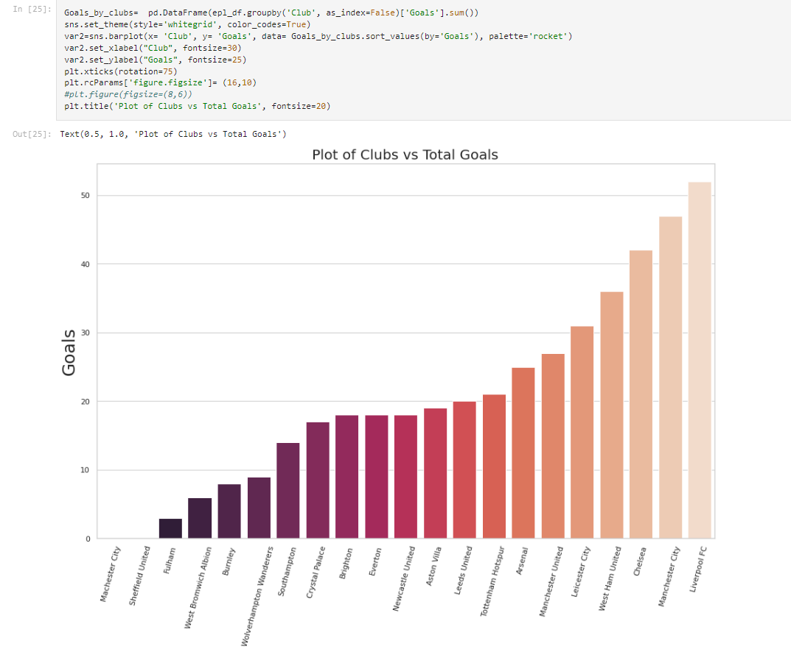
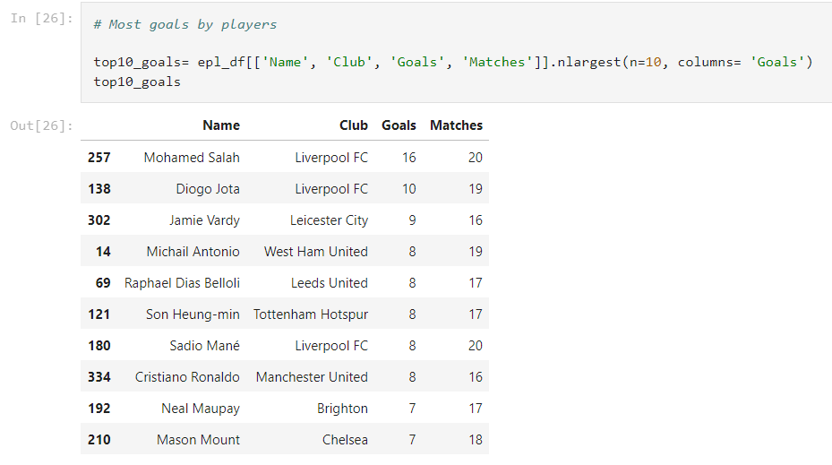
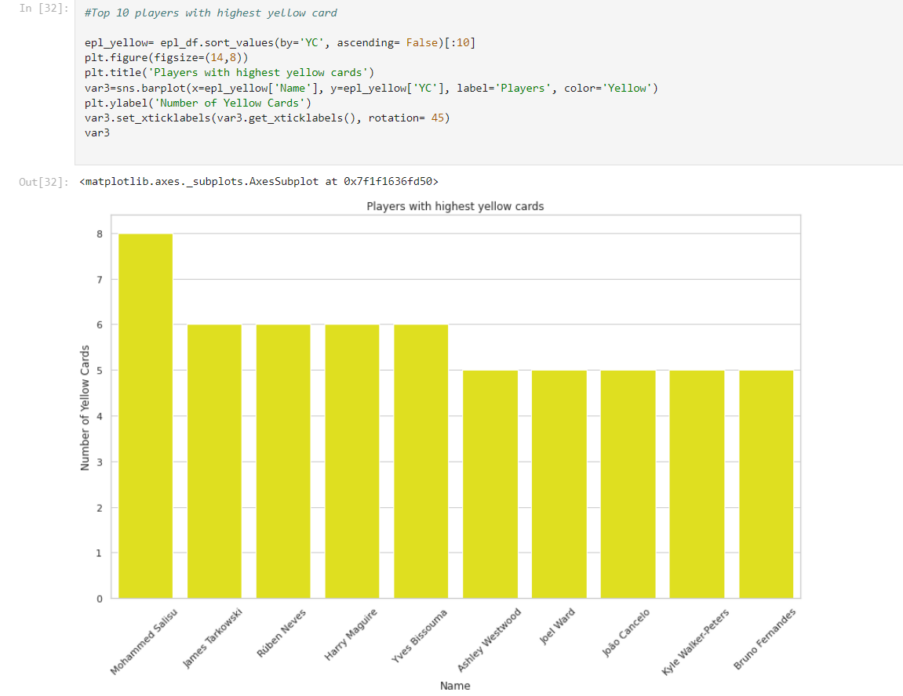

# [Football_Analytics_Portfolio](https://github.com/Vibhor2256/Football-Analytics)

*This is the repository/project on analysis of English Premier League 2021-22 player's dataset.*  
Football is the game with world's largest fan following. Also it has one of the most tecnologically advanced backing of sports science in each and every game. 
From the player details of season 2021-22 from world's best football league i.e., English Premier League (EPL), this portfolio showcases certain areas answering on 
how data analytics can be used in football. 

This project involved EDA(Exploratory Data Analysis) techniques to show different insights from the provided dataset. We can see how to analyze, visualize and draw 
insights with Python libraries and functions.

* The dataset was taken from kaggle competition. The dataset had various fields like:- Name of the player, Club, Nationality, Position of Playing, No. of Matches, No. of
starts, Minutes played, No. of full 90min game, No. of Goals, No. of Assists, No. of non-penalty goals, No. of penalty goals, No. of penalties attempted, Yellow cards
received, Red cards received, Expected goals, Expected assists, Expected goals per 90, Expected assists per 90, No. of shot creating pass, No. of shot creating dribble,
No. of total completed pass, No. of pass attempted, No. of key pass, No. of cross, No. of touches, No of successful dribble, Minutes per match, No of Goals per match.

* Below are some snapshots of the dataset :-    
* Checking for if any NULL/Missing values :-     
* Analysed then visualised penalty missed Vs scored :-     
* Showing the visuals of counrty-wise player count :-     
* Showing the histogram graph of clubs with most player count :-     
* Showing the bar plot of clubs in ascending order of goals scored :-     
* Top 10 Players with most goals scored :-     
* Top 10 most indisciplined Players with most yellow cards :-   

